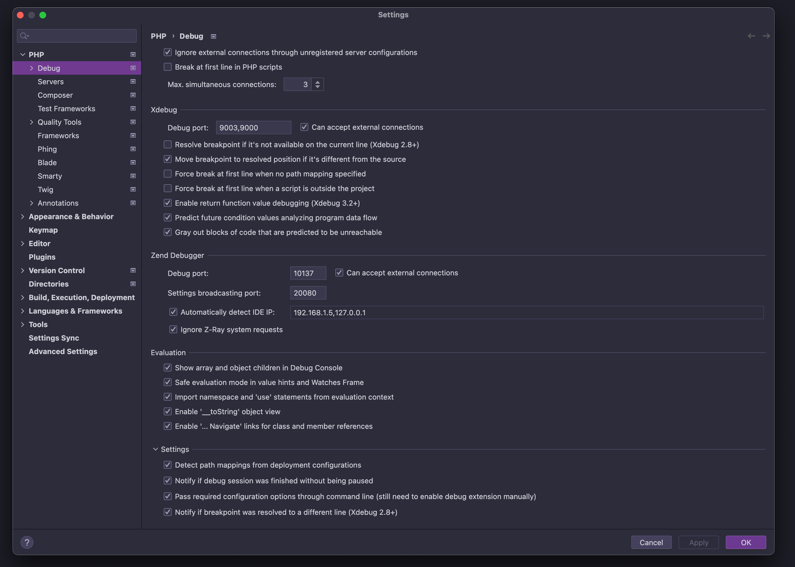
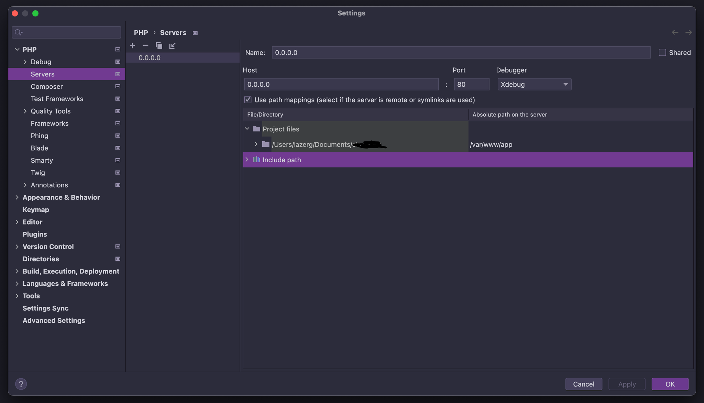

Docker images for Laravel development with PHP (8.0-8.5), Node.js, Composer, and essential extensions pre-installed.

## Usage

```bash
docker pull lazerg/laravel:php84
```

```yaml
# docker-compose.yml
services:
  app:
    image: lazerg/laravel:php84
    volumes:
      - .:/var/www/app
    ports:
      - "9000:9000"
```

## Available Tags

| Tag Name | PHP Version | Node Version |
| --- | --- | --- |
| `php85`, `php85-xdebug` | `8.5.9` | `v24` |
| `php84`, `php84-xdebug` | `8.4.24` | `v24` |
| `php83`, `php83-xdebug` | `8.3.33` | `v24` |
| `php82`, `php82-xdebug` | `8.2.33` | `v24` |
| `php81`, `php81-xdebug` | `8.1.34` | `v24` |
| `php80`, `php80-xdebug` | `8.0.30` | `v24` |

## Pre-installed

**PHP Extensions:** GD, Swoole, Redis, PDO MySQL, PDO PostgreSQL, Zip, Intl, Exif, Sockets, PCNTL, xDebug (in `-xdebug` variants)

**Tools:** Composer, Node.js, npm, Yarn, pnpm, Git, Nginx, Supervisor, SQLite3, nano, mc, htop, wget

---

### Enabling xDebug in PHPStorm

inspired from here: https://youtu.be/4opFac50Vwo




